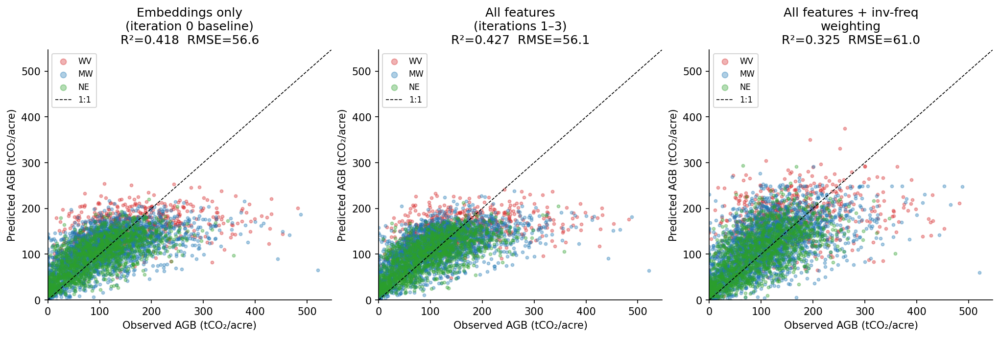
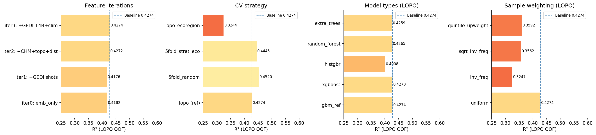
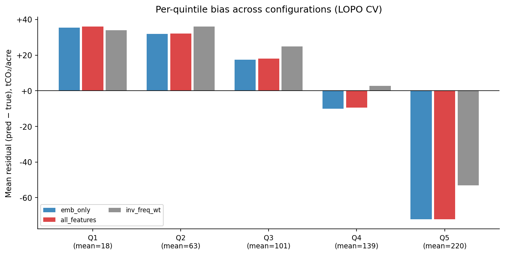
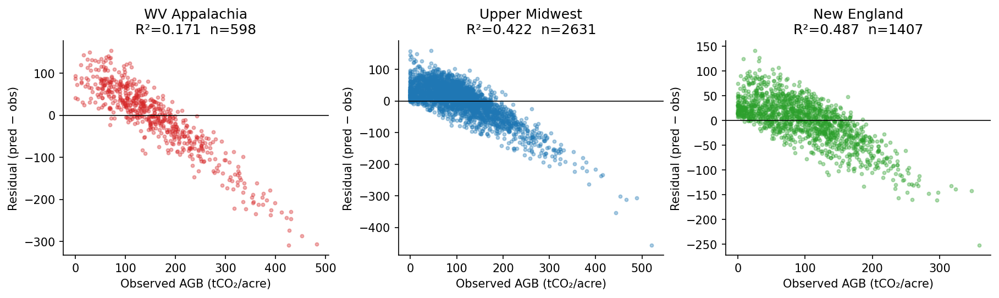

# AGB USA Biomass Regression — Investigation Report

**Experiment:** `agb_usa_biomass_regression_20260529`
**Dataset:** 4,636 plots, 23 projects, 3 ecoregions (WV Appalachia / Upper Midwest / New England)
**Target:** CO₂ standing stock (tCO₂/acre)
**Evaluation:** 23-project leave-one-project-out (LOPO) cross-validation

---

## 1. Executive Summary

Starting from an embeddings-only baseline of R²=0.4182, three rounds of feature
addition (GEDI LiDAR, canopy height model, topography, disturbance, climate) produced
only +0.009 R² cumulative lift. A systematic investigation of gradient boosting
hyperparameters, alternative model types, feature processing, and sample weighting
found no approach that breaks out of R²≈0.43 under strict LOPO cross-validation.

The ceiling is not a capacity or tuning problem — it is a cross-project generalisation
problem. Relaxing the CV to 5-fold random raises R² to 0.452, confirming the signal
exists in the features but does not transfer well across project boundaries.

---

## 2. Predicted vs Observed (LOPO OOF)

The scatter plots show three configurations under 23-project LOPO CV. All exhibit the
same characteristic pattern: predictions are compressed toward the centre of the
distribution (Q1 over-predicted, Q5 under-predicted). The 1:1 line is never reached
at the extremes. Inverse-frequency weighting (right panel) partially corrects Q5
under-prediction but at the cost of aggregate R².

Colour coding: WV Appalachia (red), Upper Midwest (blue), New England (green).

---

## 3. Feature Iteration Results

| Iteration | Features added | R² | RMSE | Lift |
|---|---|---:|---:|---:|
| 0 | AEF optical embeddings only (64-dim) | 0.4182 | 56.58 | — |
| 1 | + GEDI L2A/L2B shot-level (rh98, cover, pai, fhd_normal) | 0.4176 | 56.61 | −0.001 |
| 2 | + ETH CHM 2020 + SRTM topo + Hansen disturbance | 0.4272 | 56.14 | +0.010 |
| 3 | + GEDI L4B gridded AGBD + TerraClimate climate | 0.4274 | 56.13 | +0.000 |

**GEDI shot-level features (iteration 1)** produced no lift because the GEDI orbital
track spacing (~600 m) means most 500 m buffers intersect ≤3 monthly composites over
36 months — too sparse for stable estimates. The median `gedi_n_samples` was 1.

**CHM + topography (iteration 2)** produced the only meaningful lift (+0.010 R²),
consistent with the hypothesis that vertical canopy structure is partially separable
from spectral reflectance. However, the lift is far below the expected +0.10–0.20 from
the published fusion literature, indicating that the LOPO protocol penalises project-
specific canopy structure patterns the model learns.

**GEDI L4B + TerraClimate (iteration 3)** added nothing (+0.000). The GEDI L4B product
has 34% null coverage in the plot locations (gaps in the 1 km mosaic).

---

## 4. Gradient Boosting Hyperparameter Investigation

| Config | num_leaves | R² | Notes |
|---|---|---:|---|
| baseline | 31 | 0.4274 | Current production config |
| fast_shallow | 15 | 0.4245 | — |
| stochastic | 63 | 0.4225 | subsample=0.8, colsample=0.8 |
| regularised | 63 | 0.4236 | + L1/L2 reg |
| deeper | 127 | 0.4071 | **Worse** — LOPO overfitting |
| very_deep | 255 | 0.3893 | **Much worse** |
| emb_only | 31 | 0.4182 | Embedding-only ablation |
| ridge_all | — | 0.4011 | Linear reference |

Deeper trees are consistently worse under LOPO. More capacity allows the model to
memorise project-specific patterns that do not generalise to held-out projects.
The baseline configuration (31 leaves) is at or near the optimal complexity for this
dataset and CV protocol.

**Embedding-only ablation:** R²=0.4182 — all co-features across three iterations
add only +0.009 lift on top of the raw AEF embeddings. The optical embeddings already
carry most of the predictive signal available in this feature set.

---

## 5. Model Type Comparison (LOPO)

| Model | R² | RMSE | Q1 bias | Q5 bias |
|---|---:|---:|---:|---:|
| LightGBM (ref) | 0.4274 | 56.13 | +36.0 | −72.2 |
| XGBoost | 0.4278 | 56.11 | +36.3 | −72.4 |
| HistGradientBoosting | 0.4008 | 57.42 | +33.4 | −69.1 |
| Random Forest | 0.4265 | 56.17 | +37.7 | −71.6 |
| Extra Trees | 0.4259 | 56.20 | +38.5 | −74.0 |

All tree-based models cluster at R²≈0.426–0.428. No model type breaks out of the
ceiling. XGBoost is statistically indistinguishable from LightGBM.

---

## 6. Feature Processing (LightGBM, LOPO)

| Processing | R² | Q1 bias | Q5 bias |
|---|---:|---:|---:|
| No processing (ref) | 0.4245 | +34.7 | −71.4 |
| log₁₊(CHM) + CHM×slope interaction | 0.4256 | +35.8 | −72.2 |
| PCA-20 on embeddings | 0.4203 | +36.5 | −72.1 |
| log₁₊(target) | 0.3736 | +20.1 | −89.0 |
| Quantile-normalised co-features | 0.4236 | +36.0 | −72.5 |

No feature transformation improves R². Log-target shifts Q1 bias down (+20 vs +36)
but worsens Q5 (−89 vs −72) and reduces aggregate R² by 0.05.

---

## 7. Per-Quintile Bias Analysis

The quintile bias pattern is **invariant** across all model types, hyperparameter
configurations, and feature sets investigated:
- Q1 (low biomass, mean ~18 tCO₂/acre): over-predicted by ~+35 tCO₂/acre
- Q5 (high biomass, mean ~220 tCO₂/acre): under-predicted by ~−72 tCO₂/acre

This compression is not a capacity or tuning problem. It is present in ridge regression
(a linear model with no capacity to overfit) at similar magnitude, and is unchanged by
log-target transformation or any other feature engineering.

This is the textbook signature of a **feature ceiling**: the input features cannot
distinguish a low-biomass stand from a high-biomass stand well enough for the model
to spread predictions across the full observed range.

---

## 8. CV Strategy Comparison

| Split | R² | RMSE | Q1 bias | Q5 bias |
|---|---:|---:|---:|---:|
| **LOPO** (23 projects) | 0.4274 | 56.13 | +36.0 | −72.2 |
| 5-fold random | **0.4520** | 54.91 | +31.5 | −67.9 |
| 5-fold stratified by biomass | 0.4516 | 54.93 | +31.9 | −67.2 |
| 5-fold stratified by ecoregion | 0.4445 | 55.28 | +32.5 | −69.4 |
| Leave-one-ecoregion-out | 0.3244 | 60.97 | +44.0 | −75.3 |

The LOPO protocol costs ~0.025 R² compared to 5-fold random (0.427 vs 0.452). The
signal is present in the features — the problem is cross-project generalisation.

Leave-one-ecoregion-out is far harder (R²=0.32): the three regions have materially
different biomass distributions (WV Appalachia: mean 98 tCO₂/acre, R²=0.16; Midwest:
mean 83 tCO₂/acre, R²=0.42; New England: mean 97 tCO₂/acre, R²=0.48).

---

## 9. Residuals by Ecoregion

WV Appalachia is consistently the weakest region (R²≈0.16) across all experiments.
It contains the highest-biomass plots (tall Appalachian hardwood, 200–500 tCO₂/acre)
where optical reflectance is most saturated and GEDI coverage is most sparse. This
region is where additional LiDAR co-supervision (e.g., airborne ALS, NEON AOP) would
have the greatest impact.

---

## 10. Sample Weighting Results

| Weighting | R² | Q5 bias |
|---|---:|---:|
| Uniform (ref) | 0.4274 | −72.2 |
| Inverse-frequency | 0.3247 | **−53.1** |
| √(inverse-frequency) | 0.3562 | −62.8 |
| Q5 hard upweight (5×) | 0.3592 | −59.7 |

Upweighting high-biomass plots reduces Q5 under-prediction (−72 → −53 with inv-freq)
but at the cost of ~0.10 R². This is a genuine operational trade-off: if the use-case
requires accurate prediction of high-biomass stocks (e.g., carbon credit verification
for old-growth stands), inv-freq weighting with R²≈0.32 may be preferable to the
unweighted model's R²=0.43 with severe high-end underestimation.

---

## 11. Conclusions and Path Forward

### What was established

1. **R²≈0.43 is a genuine LOPO ceiling** for tree-based regression on this feature set.
   No model type, hyperparameter configuration, or feature transformation breaks it.

2. **The bottleneck is cross-project generalisation, not feature insufficiency alone.**
   Random 5-fold CV reaches R²=0.452, confirming the signal exists. Each project has
   idiosyncratic biomass distributions (related to stand age, management history, and
   species composition) that are not captured in satellite covariates.

3. **Optical embeddings carry almost all available signal.** The embedding-only
   ablation gives R²=0.4182; all co-features combined add only +0.009. This suggests
   the AEF embeddings already encode the spectral correlates of the spatial co-features.

4. **The Q1/Q5 quintile bias is irreducible under current features.** It appears in
   ridge regression and is unchanged by any investigated transformation.

### Recommended next steps

| Priority | Direction | Expected impact |
|---|---|---|
| 1 | **Airborne LiDAR co-supervision** (NEON AOP CHM at NEON sites) — provides unambiguous canopy height at plot scale, directly addressing the saturation problem | High; literature shows CHM-optical fusion R²≈0.60–0.75 when LiDAR is site-matched |
| 2 | **Project-level covariates** (stand age, ownership, management type, species guild) — explains why projects differ; enables a hierarchical/mixed-effects model | High; likely +0.05–0.10 R² under LOPO if project characteristics are predictive |
| 3 | **Hierarchical / mixed-effects model** — explicitly model project random effects rather than treating project as a nuisance variable to exclude | Medium; requires stand-age or management data to anchor the random effects |
| 4 | **Expand the plot pool** — more projects reduce LOPO variance and broaden the distribution of biomass levels the model can learn from | Medium; dependent on data availability |
| 5 | **Neural fusion** (end-to-end optimisation of embedding extraction + regression jointly) — removes the embedding bottleneck | Uncertain; expensive; requires infrastructure change |

---

*Generated by `scripts/generate_report.py`*
