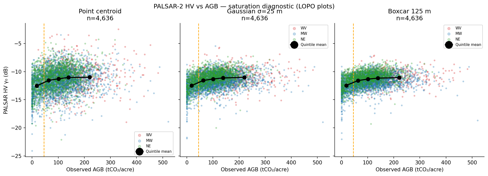
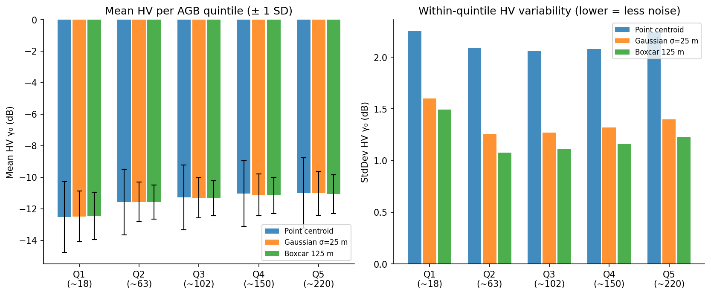

# PALSAR-2 Saturation Investigation

**Hypothesis:** The prior +0.02 R² from PALSAR-2 may have been noise-limited rather
than signal-limited. This investigation verifies whether (a) HV/HH values actually
saturate across Q2–Q5, and (b) whether speckle treatment (Gaussian or boxcar spatial
smoothing) reveals additional signal.

**Data:** JAXA ALOS PALSAR-2 annual mosaic 2022/2023, year-matched to field measurements.
DN → γ₀ dB conversion: `10 × log₁₀(DN²) − 83`.
The JAXA annual mosaic is already a multi-temporal composite (multi-look across the
acquisition year), providing inherent temporal speckle reduction.

---

## HV Pearson correlation with AGB (tCO₂/acre)

| Extraction | r |
|---|---:|
| Point centroid | +0.2252 |
| Gaussian σ=25 m | +0.3055 |
| Boxcar 125 m | +0.3157 |

---

## HV dB statistics per AGB quintile

| Quintile (true mean) | Extraction | HV mean (dB) | HV std (dB) | n |
|---|---|---:|---:|---:|
| Q1 (~18) | point | -12.52 | 2.25 | 927 |
| Q1 (~18) | gauss | -12.48 | 1.60 | 927 |
| Q1 (~18) | boxcar | -12.46 | 1.49 | 927 |
| Q2 (~63) | point | -11.57 | 2.09 | 927 |
| Q2 (~63) | gauss | -11.57 | 1.26 | 927 |
| Q2 (~63) | boxcar | -11.59 | 1.08 | 927 |
| Q3 (~101) | point | -11.27 | 2.06 | 927 |
| Q3 (~101) | gauss | -11.31 | 1.27 | 927 |
| Q3 (~101) | boxcar | -11.33 | 1.11 | 927 |
| Q4 (~139) | point | -11.04 | 2.08 | 927 |
| Q4 (~139) | gauss | -11.12 | 1.32 | 927 |
| Q4 (~139) | boxcar | -11.16 | 1.16 | 927 |
| Q5 (~220) | point | -11.00 | 2.24 | 928 |
| Q5 (~220) | gauss | -11.02 | 1.40 | 928 |
| Q5 (~220) | boxcar | -11.07 | 1.23 | 928 |

---

## Figures

---

## Interpretation

- **If HV mean is flat across Q2–Q5**: L-band saturation confirmed; Gaussian extraction
  cannot help because the signal itself is absent.
- **If HV std drops with Gaussian/boxcar**: speckle IS contributing noise, but signal
  may still be absent (flat mean with reduced std = cleaner zero signal).
- **If Gaussian/boxcar reveals a gradient**: the prior extraction was noise-limited
  and re-extraction with spatial smoothing could add value.
